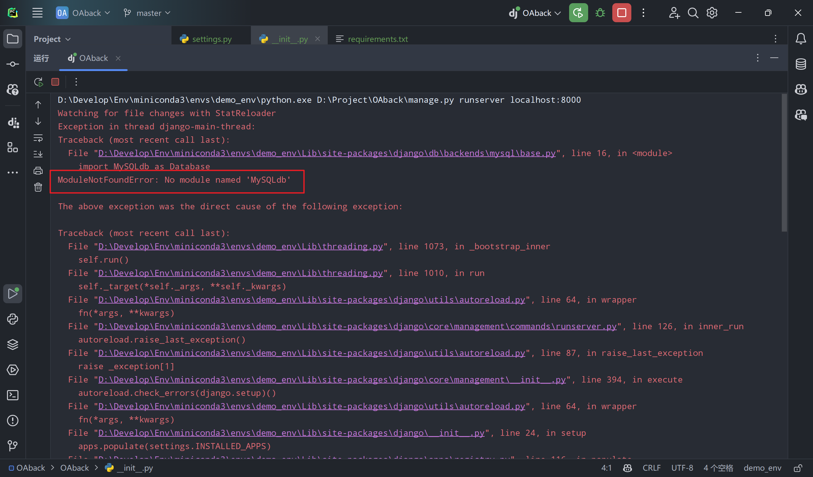
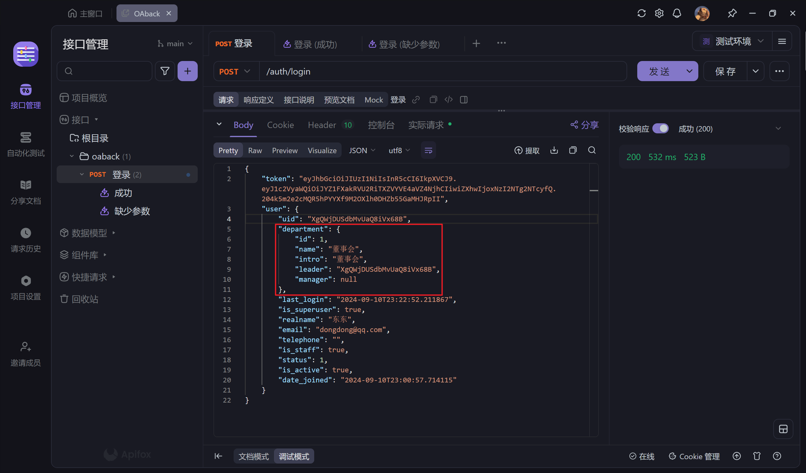

[toc]

# OAback

> 基于 `Django` 框架开发的OA系统.

## 常用命令

```shell
# 创建 django 项目
django-admin startproject [项目名称]

# 创建 django app
python manage.py startapp [app名称]

# 数据库迁移
python manage.py makemigrations
python manage.py migrate

# 创建超级用户
python manage.py createsuperuser
```


## 配置问题

### 1. 数据库

```python
DATABASES = {
    'default': {
        'ENGINE': 'django.db.backends.mysql',
        'NAME': 'djangoa',
        'USER': 'root',
        'PASSWORD': '123456',
        'HOST': 'localhost',
        'PORT': '3306'
    }
}
```


### 2. 时区及语言

- **设置时区**: 在 `settings.py` 中，将`TIME_ZONE` 设置为 `'Asia/Shanghai'`，`USE_TZ` 设置为`False`, 关闭时区支持，这是适用于中国的时区标识符.

- **设置语言**: 将`LANGUAGE_CODE`设置改为`'zh-hans'`,可以将管理员页面语言设置为简体中文.

  ```python
  # settings.py
  
  LANGUAGE_CODE = "zh-hans"
  TIME_ZONE = "Asia/Shanghai"
  USE_I18N = True
  USE_TZ = False
  ```


### 3. 中间件

```python
MIDDLEWARE = [
    'django.middleware.security.SecurityMiddleware',
    'django.contrib.sessions.middleware.SessionMiddleware',
    # 跨域中间件, 一定要放在CommonMiddleware之前
    'corsheaders.middleware.CorsMiddleware',
    'django.middleware.common.CommonMiddleware',
    # 前端通过Vue去渲染，不再使用Django的模板，并且使用JWT进行认证，不是通过cookie，无需开启csrf保护
    # 'django.middleware.csrf.CsrfViewMiddleware',
    'django.contrib.auth.middleware.AuthenticationMiddleware',
    'django.contrib.messages.middleware.MessageMiddleware',
    'django.middleware.clickjacking.XFrameOptionsMiddleware',
]
```


### 4. Celery

- Linux：`celery -A oaback worker -l INFO`
- Windows：`celery -A oaback worker -l INFO -P gevent`


## 报错问题

### 1. 数据库未正确识别



**在 Django 设置中配置 pymysql**: 在 Django 项目的 `settings.py` 或 `__init__.py` 中告诉 Django 使用 `pymysql`。在文件的顶部添加以下代码：

```python
import pymysql

pymysql.install_as_MySQLdb()
```


## Tips

### 1. Meta类的作用

> Meta类在Django的序列化器和模型中用于定义一些元数据，这些元数据可以控制序列化器或模型的行为。以下是一些常见的用途：

==序列化器==：

- `model`：指定与序列化器关联的模型。
- `fields`：指定要包含在序列化器中的字段。
- `exclude`：指定要排除在序列化器之外的字段。

==模型==：  

- `db_table`：指定数据库表的名称。
- `ordering`：指定默认的排序方式。
- `verbose_name `和 `verbose_name_plural`：指定模型的单数和复数名称。

```python
# 在序列化器中使用Meta类
class UserSerializer(serializers.ModelSerializer):
    class Meta:
        model = OAUser
        fields = "__all__"

# 在模型中使用Meta类
class OAUser(models.Model):
    # 模型字段定义
    class Meta:
        db_table = "oa_user"
        ordering = ["-date_joined"]
        verbose_name = "用户"
        verbose_name_plural = "用户"
```


### 2. 嵌套序列化器

代码示例：

```python
class DepartmentSerializer(serializers.ModelSerializer):
    """部门序列化器"""
    
    class Meta:
        model = OADepartment
        fields = "__all__"


class UserSerializer(serializers.ModelSerializer):
    """用户序列化器"""
    
    department = DepartmentSerializer()  # 嵌套序列化器, 用于序列化外键字段
    
    class Meta:
        model = OAUser
        exclude = ("password", "groups", "user_permissions")
```

  在 `UserSerializer `类中加入 `department = DepartmentSerializer()` 这行代码是为了实现嵌套序列化。嵌套序列化器用于==序列化外键字段==，使得在序列化 `OAUser `对象时，能够包含关联的 `OADepartment `对象的详细信息。  

具体来说，这样做有以下几个好处：

1. **直观的数据结构**：在序列化 `OAUser `对象时，==能够直接包含 OADepartment 对象的详细信息，而不是仅仅包含一个外键 ID==。这使得前端在处理数据时更加直观和方便。  
2. **减少查询次数**：通过嵌套序列化器，可以在一次查询中获取到关联对象的详细信息，减少了额外的数据库查询次数，提高了性能。  
3. **数据完整性**：确保在序列化过程中，关联对象的数据也能被正确地序列化和返回，保持数据的完整性。




### 3. blank和null的区别

> 在Django模型字段中，`blank`和`null`有不同的含义和用途：

- `blank=True`：表示该字段在==表单==中可以为空。它主要用于**表单验证**，允许用户在表单中不填写该字段。
- `null=True`：表示该字段在==数据库==中可以存储NULL值。它主要用于**数据库层面**，允许在数据库中存储NULL值。

通常情况下，对于字符串类型的字段（如`CharField`和`TextField`），你可能会设置`blank=True`而不设置`null=True`，因为Django会将空字符串存储为`""`而不是`NULL`。对于其他类型的字段（如`IntegerField`. `DateField`等），你可能会同时设置`blank=True`和`null=True`，以允许在表单和数据库中都为空。

例如：

```python
name = models.CharField(max_length=100, blank=True)  # 表单中可以为空，数据库中存储为空字符串
description = models.TextField(blank=True, null=True)  # 表单中可以为空，数据库中存储为NULL
```


### 4. ModelSerializer 和 Serializer的区别

> `ModelSerializer` 和 `Serializer` 都是 Django REST framework 中用于序列化数据的类，但它们有一些关键区别：

1. **`ModelSerializer`**:
   - 自动生成字段：`ModelSerializer` 会根据指定的模型自动生成序列化器字段。
   - 简化代码：由于字段是自动生成的，使用 `ModelSerializer` 可以减少手动定义字段的代码量。
   - 内置验证：`ModelSerializer` 会自动包含模型字段的验证逻辑。
   - Meta 类：需要定义一个 `Meta` 类来指定模型和字段。

2. **`Serializer`**:
   - 手动定义字段：`Serializer` 需要手动定义每个字段。
   - 灵活性：由于需要手动定义字段，`Serializer` 提供了更大的灵活性，可以处理更复杂的序列化逻辑。
   - 适用于非模型数据：`Serializer` 可以用于序列化非模型数据。

示例：

```python
# 使用 ModelSerializer
class UserSerializer(serializers.ModelSerializer):
    class Meta:
        model = User
        fields = ['id', 'username', 'email']

# 使用 Serializer
class CustomSerializer(serializers.Serializer):
    id = serializers.IntegerField()
    username = serializers.CharField(max_length=100)
    email = serializers.EmailField()
```

`ModelSerializer` 更适合直接与 Django 模型交互，而 `Serializer` 则适用于需要自定义序列化逻辑或处理非模型数据的情况。


### 5. View继承

> 在 `views.py` 中，类通常会继承以下父类：

1. **APIView**:
   - 适用于需要处理单一 HTTP 方法（如 GET、POST 等）或少量方法的视图。
   - 提供了基本的请求处理功能，如解析请求数据、返回响应等。

2. **View**:
   - 适用于需要完全自定义请求处理逻辑的视图。
   - 不提供任何默认的请求处理功能，需要手动实现所有逻辑。

3. **ViewSet**:
   - 适用于需要处理一组相关的视图操作（如列表、创建、检索、更新、删除）的视图。
   - 提供了默认的 CRUD 操作，可以通过路由器自动生成 URL 路由。

> 具体使用场景

- **继承 `APIView`**:
  - 当你只需要处理单一或少量的 HTTP 方法时。
  - 例如，展示最新的通知或处理简单的表单提交。

```python
from rest_framework.views import APIView
from rest_framework.response import Response

class LatestInformView(APIView):
    """展示最新的10条通知"""
    @staticmethod
    def get(request):
        # 处理 GET 请求的逻辑
        return Response({'msg': '最新的10条通知'})
```

- **继承 `View`**:
  - 当你需要完全自定义请求处理逻辑时。
  - 例如，处理复杂的业务逻辑或需要自定义请求和响应的格式。

```python
from django.views import View
from django.http import JsonResponse

class CustomView(View):
    """自定义视图"""
    def get(self, request):
        # 自定义 GET 请求的处理逻辑
        return JsonResponse({'msg': '自定义响应'})
```

- **继承 `ViewSet`**:
  - 当你需要处理一组相关的视图操作时。
  - 例如，处理用户的增删改查操作。

```python
from rest_framework.viewsets import ViewSet
from rest_framework.response import Response

class UserViewSet(ViewSet):
    """用户视图集"""
    def list(self, request):
        # 处理列表请求的逻辑
        return Response({'msg': '用户列表'})

    def create(self, request):
        # 处理创建请求的逻辑
        return Response({'msg': '创建用户'})
```

选择继承哪个父类取决于视图的具体需求和复杂度。


> 在 `views.py` 中，除了 `APIView`、`View` 和 `ViewSet`，还有其他常用的父类可以继承，具体取决于你的需求：

1. **GenericAPIView**:
   - 提供了更细粒度的控制，可以与混入类（mixins）结合使用。
   - 适用于需要部分定制但仍希望利用一些通用行为的视图。

2. **ListAPIView**:
   - 适用于只需要处理 GET 请求并返回一个对象列表的视图。
   - 提供了分页、过滤和排序功能。

3. **CreateAPIView**:
   - 适用于只需要处理 POST 请求并创建一个新对象的视图。

4. **RetrieveAPIView**:
   - 适用于只需要处理 GET 请求并返回一个单一对象的视图。

5. **UpdateAPIView**:
   - 适用于只需要处理 PUT 和 PATCH 请求并更新一个对象的视图。

6. **DestroyAPIView**:
   - 适用于只需要处理 DELETE 请求并删除一个对象的视图。

> 具体使用场景

- **继承 `GenericAPIView`**:
  - 当你需要部分定制但仍希望利用一些通用行为时。

```python
from rest_framework.generics import GenericAPIView
from rest_framework import mixins

class CustomGenericView(GenericAPIView, mixins.ListModelMixin, mixins.CreateModelMixin):
    """自定义通用视图"""
    queryset = MyModel.objects.all()
    serializer_class = MyModelSerializer
```

- **继承 `ListAPIView`**:
  - 当你只需要处理 GET 请求并返回一个对象列表时。

```python
from rest_framework.generics import ListAPIView

class MyListView(ListAPIView):
    """对象列表视图"""
    queryset = MyModel.objects.all()
    serializer_class = MyModelSerializer
```

- **继承 `CreateAPIView`**:
  - 当你只需要处理 POST 请求并创建一个新对象时。

```python
from rest_framework.generics import CreateAPIView

class MyCreateView(CreateAPIView):
    """创建对象视图"""
    queryset = MyModel.objects.all()
    serializer_class = MyModelSerializer
```

- **继承 `RetrieveAPIView`**:
  - 当你只需要处理 GET 请求并返回一个单一对象时。

```python
from rest_framework.generics import RetrieveAPIView

class MyRetrieveView(RetrieveAPIView):
    """获取单一对象视图"""
    queryset = MyModel.objects.all()
    serializer_class = MyModelSerializer
```

- **继承 `UpdateAPIView`**:
  - 当你只需要处理 PUT 和 PATCH 请求并更新一个对象时。

```python
from rest_framework.generics import UpdateAPIView

class MyUpdateView(UpdateAPIView):
    """更新对象视图"""
    queryset = MyModel.objects.all()
    serializer_class = MyModelSerializer
```

- **继承 `DestroyAPIView`**:
  - 当你只需要处理 DELETE 请求并删除一个对象时。

```python
from rest_framework.generics import DestroyAPIView

class MyDestroyView(DestroyAPIView):
    """删除对象视图"""
    queryset = MyModel.objects.all()
    serializer_class = MyModelSerializer
```
